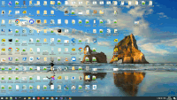

# computer_slow_turn_off

**computer_slow_turn_off** - is visual effect application. It slowly shuts down your computer. See gif to understand how it looks like. Windows only.

I use this program on my kids computers' so they don't cry when it's time to go to sleep. This way they see when the computer is going to be turned off and have 5 minutes to close their games.

Usage:

- Use system scheduler to start the program at any time you want

- **settings.json** file will be automatically created after the first run. You can change settings in it.

# Settings meaning

- **shutdown** - can be 1 or 0. If 0 than this program will just quit after the whole screen is black. Use this for testing. Or you can shutdown computer with some system command

- **password** - use any word so you could cancel the shutdown manually. There is no box for this password, just click on any black background type it in and it'll work. Case insensitive

- **ShutdownDelay** - milliseconds, how fast will the screen be covered with black.

- **ScreenWidth**, **ScreenHeight** - your screen resolution. The program is designed for single monitor. It'll still work if many displays are present but will only work on primary display.
